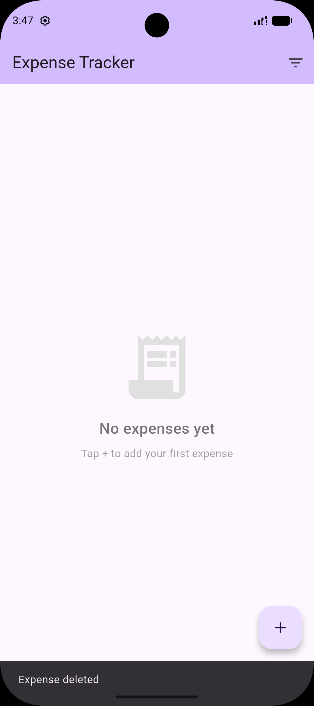
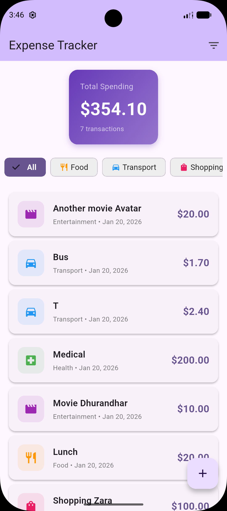
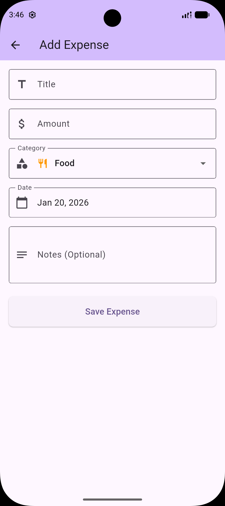
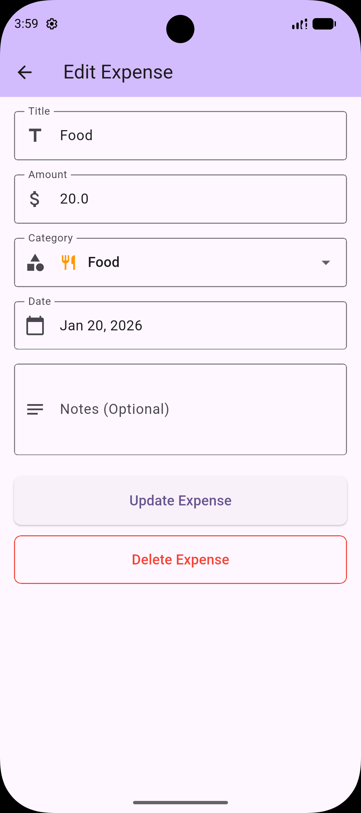
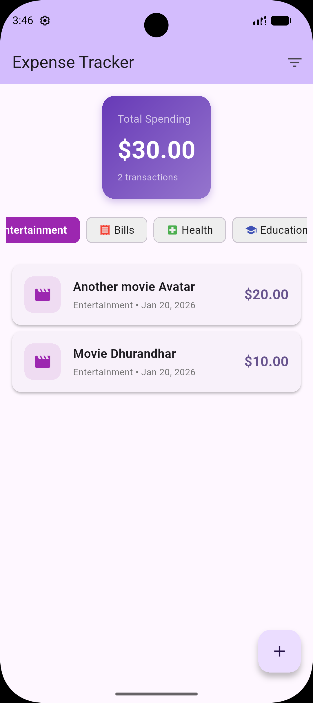

# Expense Tracker

A cross-platform mobile application for tracking personal expenses, built with Flutter and Dart.

## Screenshots

<p align="center">

  
  

  
</p>
## Features

-  Add, edit, and delete expenses
-  Organize expenses by categories (Food, Transport, Shopping, etc.)
-  Filter expenses by category
-  Offline-first data persistence
-  Real-time UI updates
-  Material Design 3 interface
-  Cross-platform (Android, iOS, Web)

## Tech Stack

- **Framework:** Flutter 3.x
- **Language:** Dart
- **Database:** Hive (NoSQL)
- **State Management:** Provider
- **UI:** Material Design 3
- **Architecture:** MVVM Pattern

## Getting Started

### Prerequisites

- Flutter SDK 3.0+
- Dart SDK 3.0+
- Android Studio / VS Code
- Android emulator or physical device

### Installation

1. Clone the repository
```bash
git clone https://github.com/YOUR_USERNAME/expense-tracker-flutter.git
cd expense-tracker-flutter
```

2. Install dependencies
```bash
flutter pub get
```

3. Run the app
```bash
flutter run
```

## Project Structure
```
lib/
├── models/          # Data models (Expense, Category)
├── screens/         # UI screens (Home, AddExpense)
├── widgets/         # Reusable widgets (CategoryFilter)
├── services/        # Business logic (ExpenseService)
├── providers/       # State management (ExpenseProvider)
├── utils/           # Constants and helpers
└── main.dart        # App entry point
```

## Database

Uses Hive for local NoSQL storage, providing:
- Fast performance
- Offline-first architecture
- Zero-config setup
- Type-safe data models

## Features Breakdown

### CRUD Operations
- **Create:** Add new expenses with title, amount, category, date, and notes
- **Read:** View all expenses in a scrollable list
- **Update:** Edit existing expenses
- **Delete:** Swipe to delete with confirmation

### Category Organization
8 predefined categories with custom icons and colors:
- Food 
- Transport 
- Shopping ️
- Entertainment 
- Bills 
- Health 
- Education 
- Others 

### State Management
- Provider pattern for reactive UI
- Real-time updates across all screens
- Efficient rebuilds with Consumer widgets

## License

This project is open source and available under the MIT License.